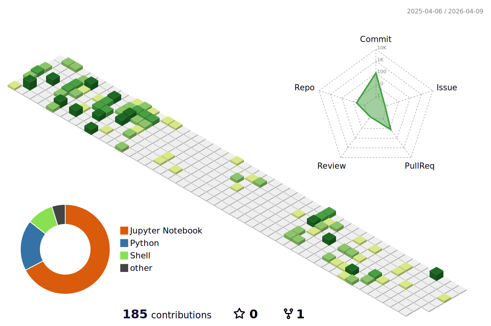

<h1 align="center">
  Hi there 👌 I'm Ignacio
</h1>

  
  

## About Me

I am an **Electrical Engineer** currently enrolled in **MSc in Computer Science** at the University of Chile, specializing in Embedded Systems, ML/CV, and MLOps. When I'm not coding, you'll find me hiking, kickboxing, or doing photography. 📸🏃‍♂️

## Stats

<picture>
  <source media="(prefers-color-scheme: light)" srcset="./profile-3d-contrib/profile-green.svg">
  
</picture>

 

## Technologies

  
  
  
  
  
  
  
  
  
  
  
  
  